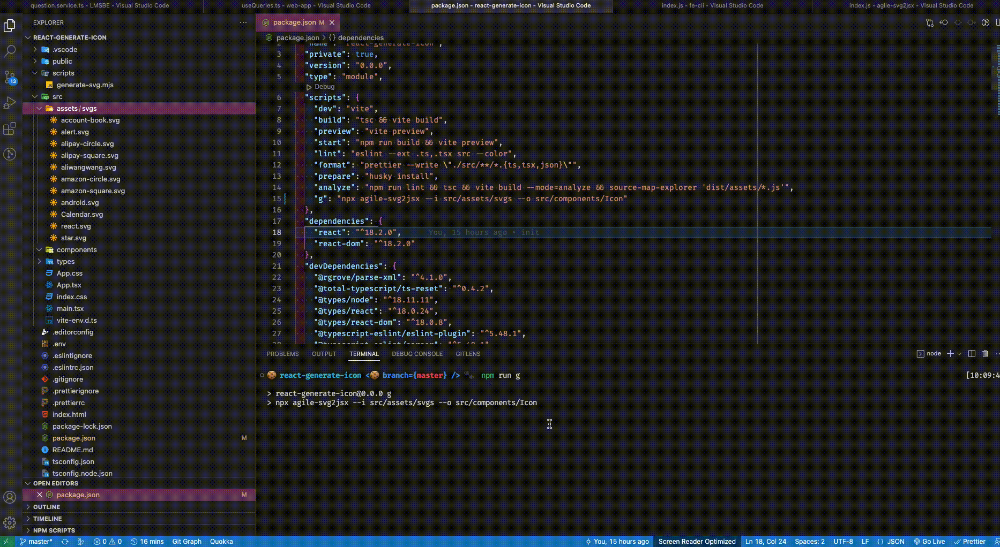

# Script generate svg react component


[](https://badge.fury.io/js/agile-svg2jsx) [](https://www.npmjs.com/package/agile-svg2jsx) [](https://www.npmjs.com/package/agile-svg2jsx)
[](#contributors-)

## Add script package.json

```bash
 "scripts": {
    ...
    "g": "npx agile-svg2jsx --i $PATH_SVGS_FOLDER --o $PATH_REACT_FOLDER"
  },
```

## Demo


